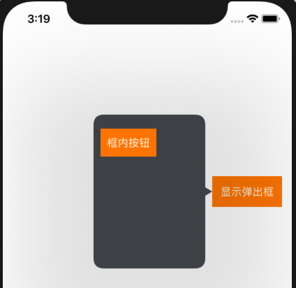

# BHPopoverBackground

## 解决的场景
* 使用苹果官方提供的UIPopoverPresentationController来解决弹框需求
* 需要定制弹出框箭头的大小




## 代码说明
### BHPopoverBackgroundView
* BHPopoverBackgroundView 继承于UIPopoverBackgroundView，并且实现了UIPopoverBackgroundViewMethods协议
    
    * **UIPopoverPresentationController** 暂不支持定制箭头，可通过配置属性popoverBackgroundViewClasss 来实现定制箭头的需要。
    * **popoverBackgroundViewClasss** 要求Class是UIPopoverBackgroundView 或者 UIPopoverBackgroundView的子类（子类需要实现UIPopoverBackgroundViewMethods协议）。

### BHPopoverBackgroundConfig
* 配置BHPopoverBackgroundView的展示

    * 配置默认值
    
    ```
    + (void)setupDefaultByArrowWidth:(CGFloat)arrowWidth
                     arrowHeight:(CGFloat)arrowHeight
                      arrowColor:(UIColor *)arrowColor
               contentViewInsets:(UIEdgeInsets)contentInsets;
    ```
    
    * 配置临时值 
    
    ```
    + (void)setTempArrowWidth:(CGFloat)arrowWidth;
    + (void)setTempArrowHeight:(CGFloat)arrowHeight;
    + (void)setTempArrowColor:(UIColor *)arrowColor;
    + (void)setTempContentViewInsets:(UIEdgeInsets)contentInsets;
    ```

## Requirements
iOS 8.0+

## Installation

BHPopoverBackground is available through [CocoaPods](https://cocoapods.org). To install
it, simply add the following line to your Podfile:

```ruby
pod 'BHPopoverBackground'
```

## Author

学宝, zhanxuebao@outlook.com

## License

BHPopoverBackground is available under the MIT license. See the LICENSE file for more info.


